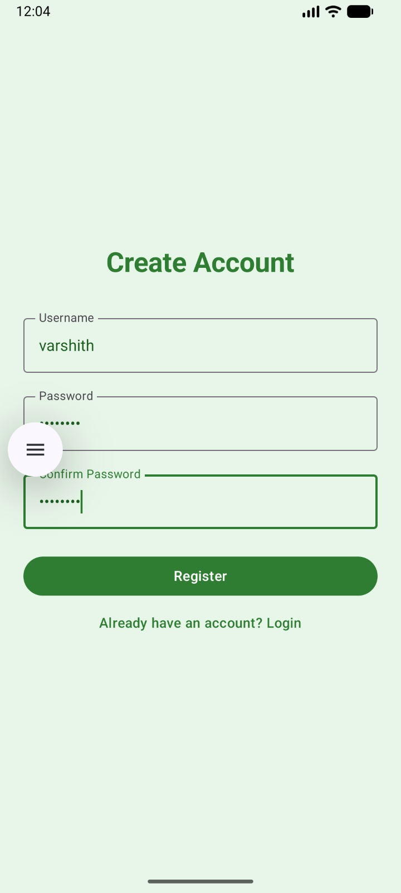
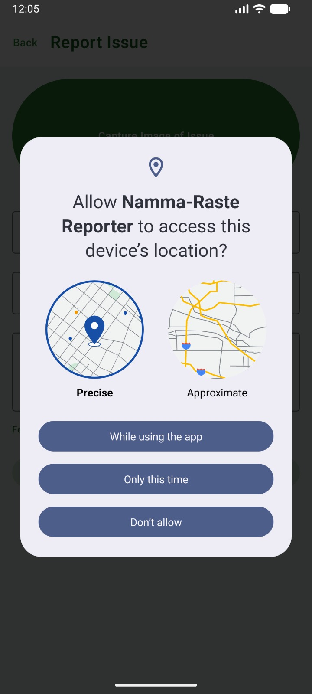
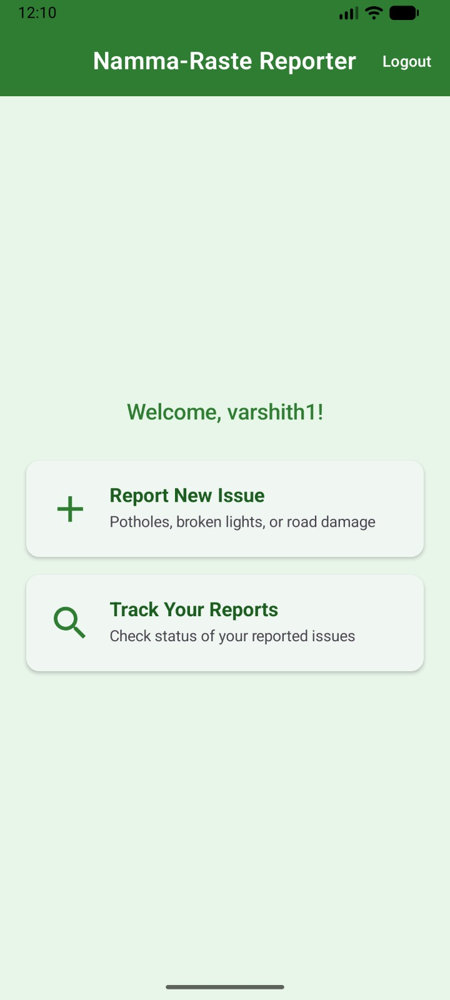
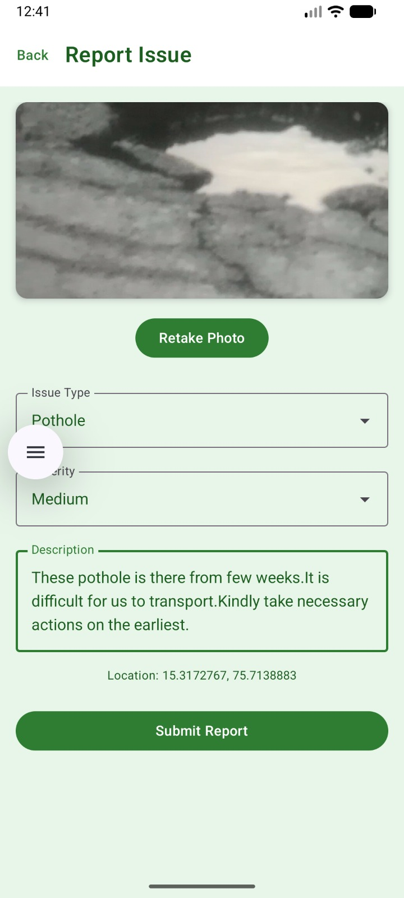
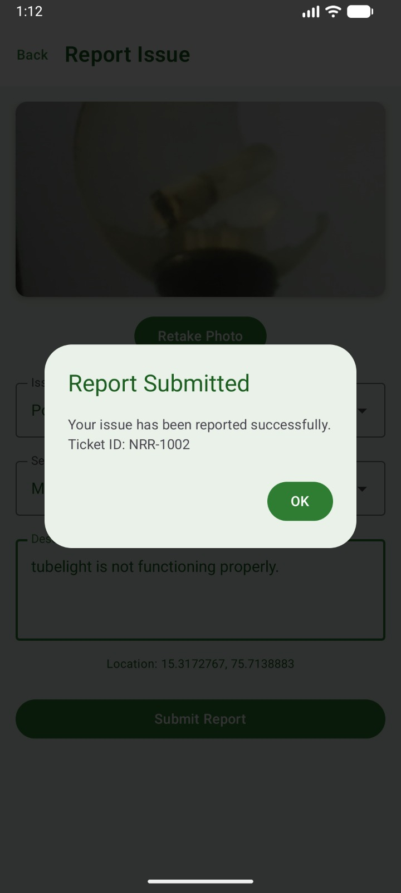
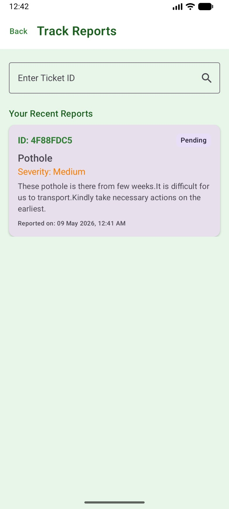
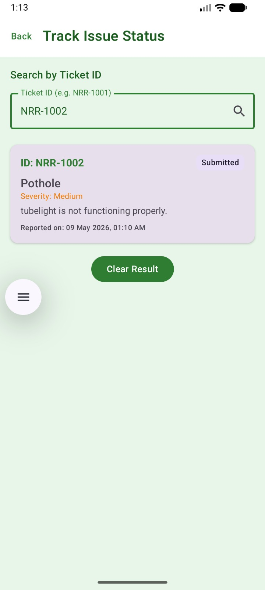
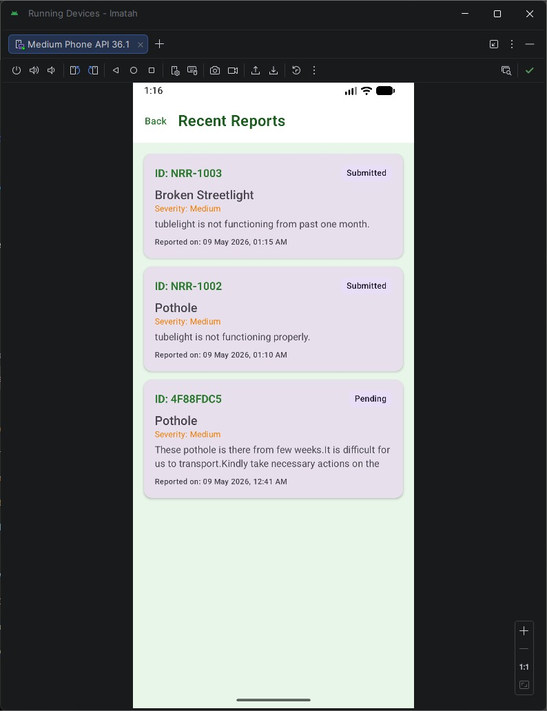

# 🚧 Namma-Raste Reporter - Civic Issue Reporting App

[](https://kotlinlang.org)
[](https://developer.android.com/jetpack/compose)

Namma-Raste Reporter is a complete Android infrastructure issue reporting application built using Kotlin and Jetpack Compose. It allows citizens to report civic issues like potholes, broken streetlights, and road damage directly to the authorities with photo evidence and GPS location.

---

# ✨ Features

- **Issue Reporting** – Capture images using CameraX, select issue type and severity.
- **Automatic Data Collection** – Automatically fetches GPS location and generates timestamps.
- **Unique Ticket IDs** – Generates unique Ticket IDs (e.g., `NRR-1001`) for every report.
- **Status Tracking** – Search and track the status of reported issues using Ticket IDs.
- **Authentication** – Simple login/register system to prevent anonymous reports.
- **Local Persistence** – Saves all reports and user data locally using Room Database.
- **Modern UI** – Clean Material3 UI with a green civic/government theme.

---

# 🏗️ Architecture

The project follows **MVVM (Model-View-ViewModel)** architecture with the following package structure:

- `ui` → Composable screens and theme
- `data` → Room Database, DAOs
- `model` → Data entities (`User`, `Report`)
- `repository` → Data handling logic
- `viewmodel` → UI state management

---

# 🛠️ Technologies Used

- **Jetpack Compose** – UI toolkit
- **Kotlin Coroutines** – Asynchronous operations
- **Room Database** – Local storage
- **CameraX** – Image capture
- **FusedLocationProviderClient** – GPS location
- **Navigation Compose** – App navigation
- **Material Design 3** – UI components

---

# 📱 Application Screenshots

## 🔐 Authentication

| Register Screen | Permission Access |
|---|---|
|  |  |

---

## 🏠 Home Screen

| Dashboard |
|---|
|  |

---

## 📝 Report Issue

| Report Issue Form | Report Submitted |
|---|---|
|  |  |

---

## 📊 Track Reports

| Track Reports | Search by Ticket ID |
|---|---|
|  |  |

---

## 📂 Recent Reports

| Recent Reports |
|---|
|  |

---

# 🎥 Demo Video

👉 [Click Here to Watch Demo Video](Snapshots/Namma%20Raste%20Demo.mp4)

---

# 🚀 Installation & Setup

## Prerequisites

- Android Studio Ladybug or newer
- Android SDK 33+
- Kotlin 2.0.0

## Steps

### 1️⃣ Clone the repository

```bash
git clone https://github.com/MuthuVarshith/Namma-Raste.git
```

### 2️⃣ Open in Android Studio

- Select **Open**
- Choose the project directory

### 3️⃣ Build and Run

- Connect a physical device or emulator
- Click the **Run ▶️** button

---

# 📌 Future Enhancements

- Firebase backend integration
- Real-time complaint updates
- Admin dashboard for authorities
- Push notifications
- Google Maps integration
- Cloud image storage

---

# 👨‍💻 Developer

**Muthu Varshith**

📧 Email: muthuvarshith290@gmail.com  
🔗 GitHub: https://github.com/MuthuVarshith

---

# ⭐ Support

If you like this project, consider giving it a ⭐ on GitHub!
